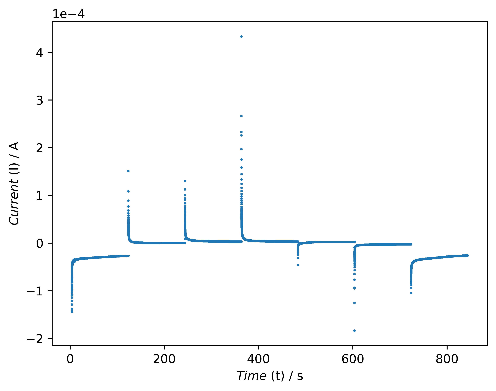

# Abstract
Envismetrics is an open-source, cross-platform Python application designed to assist researchers in the automated analysis of electrochemical data. It provides a modular toolbox that enables the processing, visualization, and parameter extraction of data from techniques such as cyclic voltammetry, chronoamperometry, and hydrodynamic voltammetry. The software supports data input from a variety of potentiostat platforms and automates routine analytical steps, including peak identification, Randles–Ševčík plots, diffusion coefficient estimation, rate constant calculations, and Tafel analysis. Envismetrics features a graphical web interface that minimizes the need for coding and enhances accessibility for researchers across disciplines.
By focusing on automation and reproducibility, Envismetrics reduces the manual workload associated with electrochemical data interpretation and promotes transparent research workflows. The source code is openly available at [https://github.com/Woffee/Envismetrics](https://github.com/Woffee/Envismetrics).

# Summary

Accurate determination of kinetic parameters and thermodynamic properties from electrochemical data is fundamental for understanding redox reactions used in diverse applications [@SANECKI2003109, @wang2020redox, @XU20106366]. These values — including diffusion coefficients, standard rate constants, transfer coefficients, and formal potentials — provide mechanistic insight and are commonly used to validate reaction pathways and simulate electrochemical behavior under various conditions [@C9CP05527D].

Although literature values exist for some well-studied redox systems, the evaluation of new analytes or experimental conditions typically requires experimental determination. Techniques such as cyclic voltammetry (CV), linear sweep voltammetry using a rotating disk electrode (LSV at RDE, under laminar flow and planar diffusion conditions), and step methods like chronoamperometry (CA) offer quantitative frameworks for extracting these parameters [@bard2022electrochemical].

Each technique supports specific analyses:

- **LSV at RDE**: Levich and Koutecký–Levich analysis [@doi:10.1021/ar50110a004; @treimer2002koutecky],
- **CV**: Randles–Ševčík plots, rate constant estimation, and transfer coefficient analysis [@doi:10.1002/adts.202500346; @LEFTHERIOTIS2007259],
- **CA**: Cottrell-based diffusion coefficient estimation [@HERATH20084324; @GOMEZ2023143400; @RODRIGUEZLUCAS2025145648].

While these methods are widely accepted, manual analysis can be labor-intensive and prone to inconsistency. To address this, **Envismetrics** is introduced as an open-source, browser-based Python application that automates data processing and analysis workflows for CV, LSV (RDE), and CA. It provides modules for filtering, peak detection, Levich regression, Randles–Ševčík analysis, and chronoamperometric fitting—offering visual outputs and tabulated results. By focusing on automation and reproducibility, Envismetrics lowers the barrier for electrochemical researchers—especially those dealing with large datasets or requiring rapid feedback—while preserving methodological rigor and transparency.

# Statement of Need

Electrochemical researchers commonly analyze data using a combination of proprietary instrument software (e.g., NOVA for Autolab), manual spreadsheet tools (e.g., Excel), and general-purpose plotting software (e.g., Origin, SigmaPlot). While proprietary software facilitates data collection and basic visualization, it is often platform-specific, instrument-dependent, and limited in automation and cross-experiment reproducibility. Tools like Origin provide flexible plotting, but require manual preprocessing, repeated formatting, and domain expertise for kinetic modeling.

Envismetrics fills this gap by offering a powerful modular, web-based platform focused on automated analysis of electrochemical data, particularly from cyclic voltammetry (CV), linear sweep voltammetry at rotating disk electrodes (LSV at RDE), and chronoamperometry (CA). By supporting common data formats like .xlsx, .csv, and .txt, Envismetrics works independently of instrument brands—allowing researchers to export plaintext data from proprietary systems and continue their analysis seamlessly.

Unlike tools that prioritize device control, Envismetrics emphasizes data processing, reproducibility, and accessibility. It features automated peak detection, Levich and Randles–Ševčík analysis, rate constant fitting, and stepwise modules, making it ideal for both routine analysis and instructional purposes. It also runs on Windows, macOS, and Linux with no installation needed.

Table 1. Comparison of Electrochemical Data Processing Tools

| **Aspect**             | **Proprietary (NOVA)**              | **Envismetrics**                                                            | **Homegrown (FuelCell)**               |
|------------------------|-------------------------------------|-----------------------------------------------------------------------------|----------------------------------------|
| **Installation**       | Windows-only installation           | Web-based, no installation needed                                           | Standalone executable                  |
| **Platform Support**   | Windows only                        | Windows, macOS, Linux                                                       | Windows, macOS, Linux                  |
| **Data Collection**    | built-in                            | requires exported files from instruments                                  | requires exported files from instruments |
| **Data Format Support**| Autolab-specific, requires export   | `.xlsx`, `.csv`, `.txt` (plaintext from any system)                         | Multiple formats                       |
| **Analysis Features**  | Basic plotting, smoothing, baseline | Automated Levich/Randles–Ševčík, peak search, rate fitting                  | Tafel slope, HFR extraction            |
| **Customization**      | Limited                             | Modular architecture, easily extensible                                     | Requires code edits                    |
| **Learning Curve**     | Steep, documentation-heavy          | Intuitive GUI with helper prompts                                           | Depends on script complexity           |
| **Publication Output** | Basic figures                       | Clean plots with export                                                     | Requires post-processing               |
| **Educational Use**    | Limited                             | Interface guides + interactive outputs                                      | Not beginner-friendly                  |
| **Hardware Dependency**| Metrohm Autolab only                | Hardware-agnostic                                                           | Hardware-agnostic                      |

[Comparison of Electrochemical Data Analysis Software]\label{table:1}

# Current Functions of Envismetrics Toolbox

To aid in interpreting the equations below, Table 2 summarizes commonly used electrochemical parameters along with their meanings and corresponding units.

> **Note**:  
> • The symbol $\nu$ appears twice in the table with different meanings:  
> &nbsp;&nbsp;&nbsp;&nbsp;– In **CV**, it denotes the *scan rate*, with units of $\mathrm{V/s}$.  
> &nbsp;&nbsp;&nbsp;&nbsp;– In **HDV (RDE)**, it denotes the *kinematic viscosity*, with units of $\mathrm{cm^2/s}$.  
> • Both the *diffusion coefficient* $D$ and *kinematic viscosity* $\nu$ share the unit $\mathrm{cm^2/s}$, but represent distinct physical phenomena—molecular diffusion and fluid flow, respectively.

| **Symbol**          | **Meaning**                                       | **Unit**               | **Context**       |
| ------------------- | ------------------------------------------------- | ---------------------- | ----------------- |
| $n$                 | Number of electrons transferred in redox reaction | —                      | All methods       |
| $n'$                | Number of electrons in preceding equilibrium      | —                      | CV (irreversible) |
| $F$                 | Faraday constant                                  | $\text{C/mol}$         | All methods       |
| $R$                 | Ideal gas constant                                | $\text{J/mol·K}$       | All methods       |
| $T$                 | Temperature                                       | $\text{K}$             | All methods       |
| $\nu$               | Scan rate (CV)                                    | $\text{V/s}$           | CV                |
| $\nu$               | Kinematic viscosity (HDV)                         | $\text{cm}^2/\text{s}$ | HDV (RDE)         |
| $D$                 | Diffusion coefficient                             | $\text{cm}^2/\text{s}$ | All methods       |
| $A$                 | Electrode area                                    | $\text{cm}^2$          | All methods       |
| $C$, $C_0$          | Concentration of electroactive species            | $\text{mol/cm}^3$      | All methods       |
| $I_{\text{peak}}$   | Peak current                                      | $\text{A}$             | CV                |
| $j$                 | Current density                                   | $\text{A/cm}^2$        | CV                |
| $\theta$            | Dimensionless overpotential                       | —                      | CV                |
| $\alpha$, $\alpha'$ | (Apparent) transfer coefficient                   | —                      | CV                |
| $k_0$               | Standard rate constant                            | $\text{cm/s}$          | CV                |
| $\Psi$              | Dimensionless kinetic parameter                   | —                      | CV                |

[Summary of parameters used in electrochemical equations]\label{table:2}

## Data Processing

Envismetrics supports commonly used plain-text electrochemical data formats, including .xlsx, .csv, and .txt, exported from potentiostat software such as EC-Lab (BioLogic), NOVA (Autolab), and Metrohm. Users can directly upload these files to the web-based interface without additional preprocessing, provided the files follow standard export structures. The software automatically parses time, current, and potential data for downstream analysis. File validation is included to help ensure compatibility and inform users of any formatting issues. Support for additional instrument vendors and data formats is actively expanding and documented in the repository.

{ width=80% }

## Hydrodynamic Voltammetry (HDV) Module

### Function 1: Plotting and Gaussian Filtering

This function plots the experimental data sorted by RPM (rotations per minute) and provides an optional Gaussian smoothing feature. Users may specify a sigma value to apply the filter — larger sigma values result in smoother curves by reducing high-frequency noise, but can also suppress sharp features in the data. To disable filtering, users should set sigma = 0.

The Gaussian filter works by convolving the current signal with a normal distribution (Gaussian kernel), helping to visualize trends in noisy electrochemical data. However, users are advised to apply filtering judiciously, as excessive smoothing may obscure important peaks or kinetic features.

### Function 2: Levich and Koutecky–Levich Analysis

Levich and Koutecky–Levich (KL) analyses are commonly used for studying electrochemical reactions under laminar flow convection conditions [@masa2014koutecky]. *Envismetrics* streamlines these workflows by automatically generating both Levich and KL plots from experimental data.

Levich analysis is primarily used to determine the diffusion coefficient $D$ under mass-transport-limited conditions. The classical Levich equation is:

$$
i_L = 0.62\, n F A D^{2/3} \omega^{1/2} \nu^{-1/6} C
$$

Koutecky–Levich analysis expands on this by incorporating kinetic limitations and is often used to estimate the standard rate constant $k_0$. It retains the same diffusion-related slope as the Levich plot. The KL equation is:

$$
\frac{1}{i} = \frac{1}{i_k} + \frac{1}{i_L}
$$

Or explicitly:

$$
\frac{1}{i} = \frac{1}{n F A k^0 C} + \frac{1}{0.62\, n F A D^{2/3} \omega^{1/2} \nu^{-1/6} C}
$$

In *Envismetrics*, users can select potential values to automatically generate these plots, with slopes and derived kinetic parameters $D$ calculated dynamically for each potential. This feature enables users to explore the potential dependence of apparent kinetics and identify plateaus where mass transport dominates. Users should apply Levich/KL analyses only in regions where steady-state limiting currents are observed. *Envismetrics* allows flexible selection of such regions, but interpretation should follow electrochemical theory to avoid applying these models in inappropriate potential windows.

> **Note**: While *Envismetrics* displays diffusion coefficients calculated at multiple potentials, this is **not intended to imply that $D$ varies with potential**. Rather, each $D$ value is obtained by applying the **definitional form** of the Levich equation at a specific potential. In practice, current values — even within the limiting current plateau — often fluctuate slightly due to experimental noise, convection, or surface effects.  
>
> By plotting $D$ across a range of potentials, users can:
> - Visually identify regions where $D$ remains consistent;
> - Average $D$ values across the plateau for better statistical reliability;
> - Avoid misinterpretation caused by using a single-point calculation.
>
> This diagnostic approach does **not** suggest physical dependence of $D$ on potential, but rather supports informed analysis based on electrochemical theory.

{ width=45% }
{ width=45% }

![Example of figures in Envismetrics(HDV Module): (a) Levich plot module, (b) Levich analysis module.]

  <figure style="width: 49%;">
    
    <figcaption><strong>(a)</strong> Levich plot module</figcaption>
  </figure>
  <figure style="width: 49%;">
    
    <figcaption><strong>(b)</strong> Levich analysis module</figcaption>
  </figure>

> **Figure: Example outputs from the Envismetrics HDV module.** (a) Raw Levich plot showing current vs. $\omega^{1/2}$. (b) Extracted slope and calculated diffusion coefficients for selected potentials. These visual outputs help users identify steady-state plateaus and assess electrochemical transport behavior.

## Cyclic Voltammetry (CV) Module

### Function 1: Plotting and Gaussian Filtering

This function plots cyclic voltammetry data sorted based on the rate constant value and allows users to apply a Gaussian filter for smoothing. Users can input the sigma value to adjust the degree of smoothing. Both the original figure and the smoothed data will be displayed, allowing users to compare the raw and processed results.

### Function 2: Peak Searching

Peak searching is essential for calculating formal potential, peak separation, and performing Randles-Ševčík analysis. The software provides multiple searching methods, such as max/min and knee/elbow detection within specific ranges, allowing the analysis of multiple peaks and complex reactions. The software will record all the peak points for use in future analyses, and the results will be displayed in a plot.

### Function 3: Randles–Ševčík Analysis

The Randles–Ševčík analysis utilizes equations that incorporate the transfer coefficient and calculate the diffusion coefficient from the peak current and scan rate. This function supports both reversible and irreversible versions of the Randles–Ševčík equation [@zanello2019inorganic]. The peak information data used in this analysis is obtained from Function 2 (Peak Searching):

$$
I_{\text{peak}} = 0.4463 \ n \ F \ C \ A \sqrt{\frac{n F \nu D}{R T}}
$$

$$
I_{\text{peak}} = 0.4463 \sqrt{n^{\prime} + \beta} \ n \ F \ C \ A \sqrt{\frac{n F \nu D}{R T}}
$$

### Function 4: Standard Rate Constant Calculation

The standard rate constant, $k^0$, is calculated using a dimensionless kinetic parameter, $\Psi$, which relates $k^0$ to the system’s electrochemical and physical properties. This method is based on the classical Nicholson model [@nicholson1965theory] and was extended by Lavagnini et al. [@lavagnini2004extended] to cover a broader range of peak separations ($\Delta E_p$).

Envismetrics automatically estimates $\Psi$ from the peak-to-peak separation and applies the empirical Lavagnini relationship:

$$
\Psi = \frac{0.6288 + 0.0021 \cdot X}{1 - 0.017 \cdot X}, \quad X = \Delta E_p \cdot n \quad (\text{in mV})
$$

For systems with large $\ Delta E_p$ or highly irreversible behavior, Envismetrics also supports the Klingler–Kochi formulation:

$$
\Psi = \frac{2.18}{\alpha \pi} \exp \left( - \frac{\alpha n \Delta E_p F}{2RT} \right)
$$

From $\Psi$, the standard rate constant is then calculated as:

$$
k^0 = \Psi \cdot \left( \frac{D \cdot n \cdot F}{R \cdot T} \right)^{1/2}
$$

---
This method assumes that the electrochemical process is diffusion-controlled, with no coupled chemical reactions or adsorption phenomena. It is applicable primarily to well-defined, peak-shaped cyclic voltammograms (CVs) under quasi-reversible or irreversible conditions. The diffusion coefficient $D$ must be known or reliably estimated beforehand. Since the Lavagnini approach is empirical, it performs best when the standard rate constant $k_0$ lies within an intermediate kinetic range—not too fast or too slow. Users should interpret $k_0$ results in accordance with electrochemical theory to avoid misapplication outside valid regimes.

This function allows users to compare kinetic behavior across different systems using consistent theoretical models, while providing flexibility in selecting which method to apply based on the peak separation and system reversibility.

### Function 5: Tafel Analysis Module

Tafel analysis is used to determine the anodic and cathodic transfer coefficients. The International Union of Pure and Applied Chemistry (IUPAC) formally defines these coefficients as experimentally determined values, given by [@guidelli2014defining]:

$$
\alpha_a = \frac{RT}{F} \left( \frac{d \ln j_{a, \text{corr}}}{dE} \right)
$$

$$
\alpha_c = -\frac{RT}{F} \left( \frac{d \ln |j_{c, \text{corr}}|}{dE} \right)
$$

Additionally, the mass-transport corrected version proposed by Danlei Li et al. [@LI2018117] is implemented in this module. This method has also been applied in other research, including the study of dopamine oxidation at gold electrodes conducted by Bacil and co-workers [@zanello2019inorganic]. The transfer coefficient is calculated by: 

Function 2: Peak Searching
$$
-\frac{d\ln \left( \frac{1}{I_a} - \frac{1}{I_{\text{peak}}} \right)}{d\theta} = \alpha_a'
$$

where peak potentials and corresponding peak currents are identified using Function 2: Peak Searching, which applies max value and derivative-based detection algorithms.

{ width=45% }
{ width=45% }

![Example of figures in Envismetrics(CV Module): (a) Peak Searching module, (b) Randles–Ševčík Analysis Module.]

## Step Techniques Structure: CA Module

### Function 1: Plotting and Gaussian Filtering

This function generates plots of applied potential vs. time and corresponding current vs. time. Users have the option to input a sigma value to apply a Gaussian filter, which smooths the data for clearer visualization. Both the original and smoothed figures are displayed, allowing for easy comparison and analysis.

### Function 2: Cottrell Equation Plot

This function utilizes the Cottrell equation to calculate the diffusion coefficient. The Cottrell equation describes the current response of an electrochemical cell as a function of time, providing a means to determine the diffusion coefficient from chronoamperometric data. The software plots the Cottrell equation, allowing users to input parameters such as interval, \( n \), \( A \), and \( C_0 \), and calculates the diffusion coefficient. The outputs include a figure of the Cottrell equation plot and a table of diffusion coefficients.

{ width=45% }
{ width=45% }

![Example of figures in Envismetrics(CA Module): (a) Peak Searching module, (b) Randles–Ševčík Analysis Module.]

## Applications in Research

Envismetrics has been employed in various research projects, demonstrating its versatility in the analysis of electrochemical systems. For instance, the software was utilized in the investigation of photocatalytic degradation of perfluorooctanoic acid (PFOA), published in *Chemosphere* [@OSONGA2024143057], where it facilitated the precise analysis of kinetic parameters essential to understanding the degradation mechanisms. Additionally, Envismetrics played a key role in mechanistic studies on the electrochemical oxidation of dimethylamine borane (DMAB), as documented in recent works [@sadik2024dimethylamine,@Xue_2023,@TORABFAM2025107950]. In these studies, Envismetrics enabled the accurate processing of electrochemical data, which was crucial for validating the proposed mechanisms and deriving key kinetic parameters.

## Author Contributions (CRediT Taxonomy)

- **Huize Xue**: Conceptualization, Methodology, Software, Formal Analysis, Visualization, Data Curation, Writing – Original Draft.  
  Led the design and development of the electrochemical analysis pipeline, including Python-based processing tools and experimental method validation. Also responsible for manuscript writing and figure preparation.
- **Wenbo Wang**: Software, Writing – Review & Editing, Data Curation, Project Administration.  
  Contributed to the front-end interface, online platform development, and GitHub repository maintenance. Assisted in server deployment and manuscript refinement.
- **Xinxin Zhou**: Validation, Testing, Documentation.  
  Performed internal testing of the software and contributed to documentation and usability feedback.
- **Fuqin Zhou**: Investigation, Data Curation.  
  Supported data formatting and assisted with exploratory testing of selected modules.
- **Omowunmi Sadik**: Supervision, Project Administration, Funding Acquisition.  
  Provided scientific oversight and strategic guidance throughout the project. Contributed to the refinement of analysis direction and manuscript review.

# Technology Stack

The online platform is primarily built with Python, leveraging the Flask framework. JQuery is employed for real-time features and asynchronous tasks. More details can be found on our GitHub repo.

# Acknowledgments
The authors acknowledge the NJIT Start-ups (172803) and the Bill Melinda Gates Foundation for funding.

# Conflict of Interest
The authors confirm that we have read the JOSS conflict of interest policy, that we have no COIs related to reviewing this work, and that JOSS has waived any perceived COIs for the purpose of this review.

# Code of Conduct
The authors confirm that we read and will adhere to the JOSS code of conduct.

# References
